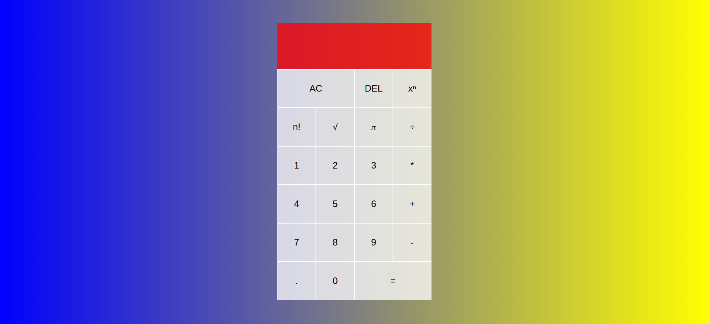

# Project: Calculator

> Project was about creating a calculator
> using JavaScript concpets and ES6 syntax

## Built With

- CSS/Grid
- JavaScript

## Live Demo

[Live Demo Link](https://cvilla714.github.io/odin-calculator/)

## Getting Started

**To get a copy of the code please click on the green button on the top right corner that says Code**

### Install

**Now to clone it to your local machine please open your terminal and paste this code `git@github.com:cvilla714/odin-calculator.git`**

**Then you can go into the directory by typig `cd odin-calculator `**

### Usage

**Once you have gone through the process of installing the code you now you can use to open the index.html inside your editor with live-server to open the game in new tab in your web browser**

## Authors

👤 **Cosmel Villalobos**

- Github: [@cvilla714](https://github.com/cvilla714)
- Twitter: [@kckeyti](https://twitter.com/kckeyti)
- LinkedIn: [Cosmel Villalobos](https://www.linkedin.com/in/cosvilla/)

## 🤝 Contributing

Contributions, issues, and feature requests are welcome!

Feel free to check the [issues page](https://github.com/cvilla714/odin-calculator/pulls).

## Show your support

Give a ⭐️ if you like this project!

## 📝 License

This project is [MIT](https://github.com/cvilla714/odin-calculator/blob/master/LICENSE) licensed.
